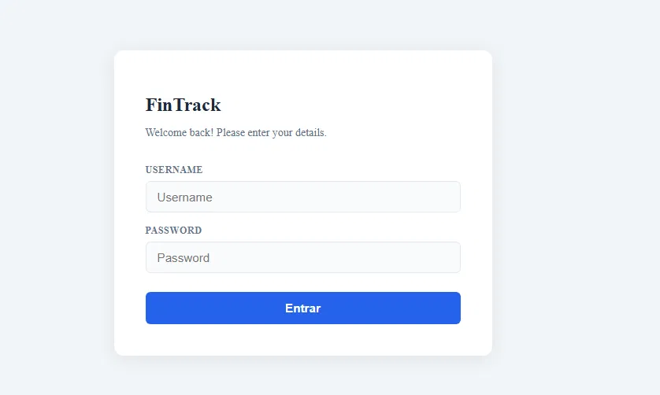
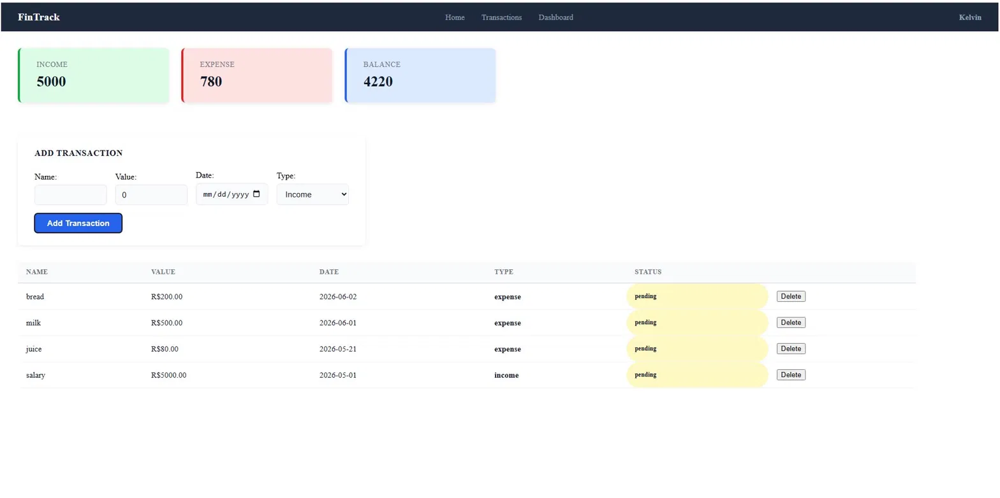

# FinTrack — Sistema Financeiro



Aplicação web full stack para controle financeiro pessoal. Permite registrar transações de entrada e saída, visualizar resumo financeiro e acompanhar o saldo em tempo real.

## 🖥️ Demo

> https://fintrack-five-woad.vercel.app

## ✨ Funcionalidades

- Autenticação com JWT — login e logout
- Rotas protegidas — acesso só para usuários autenticados
- Dashboard com resumo de entradas, saídas e saldo
- Cadastro de transações com nome, valor, data e tipo
- Tabela de transações com status e cores por tipo
- Deletar transações
- Cálculo automático de totais em tempo real

## 🚀 Tecnologias

- React 19
- TypeScript
- Vite
- React Router v6
- JWT Authentication
- CSS Modules

## 🔧 Como rodar localmente

```bash
# Clone o repositório
git clone https://github.com/kellzero/fintrack.git
cd fintrack

# Instale as dependências
npm install

# Rode o projeto
npm run dev
```

Acesse http://localhost:5173

## 🔗 Back-end

API desenvolvida em Django REST Framework: [fintrack-api](https://github.com/kellzero/fintrack-api)